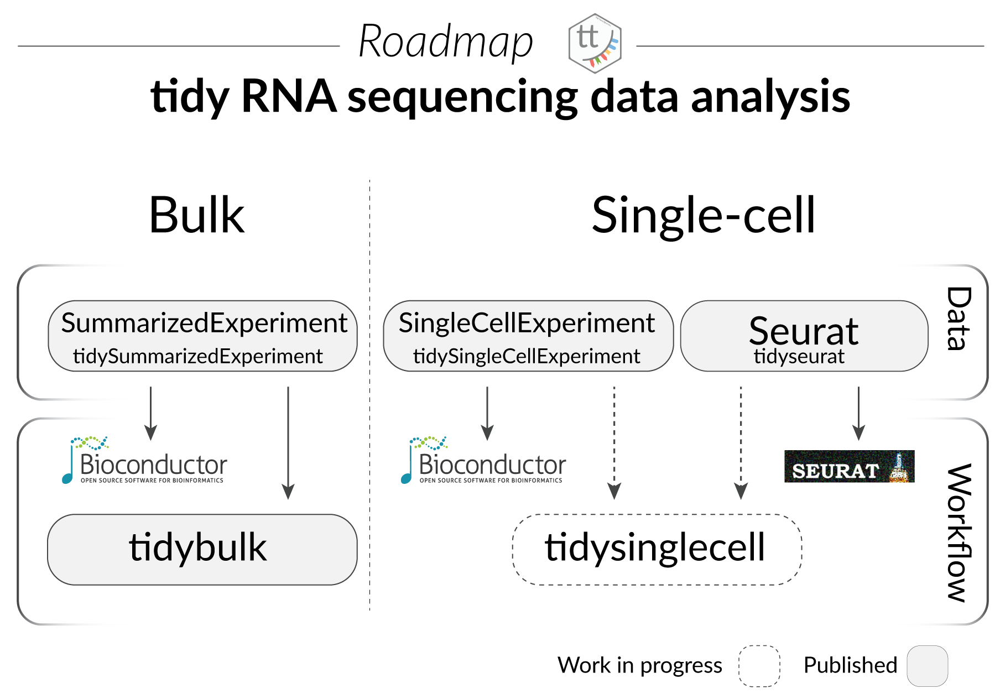

<!-- badges: start -->

<!-- badges: end -->

The manifesto, workshops and tutorials of the tidy transcriptomics.
**All this is very work-in-progress**

# The tidy transcriptomics manifesto
This document lays down the principles of tidy transcriptomics, of which `tidybulk` and `tidysc` are based on. These principles are in line with [the tidy tools manifesto](https://cran.r-project.org/web/packages/tidyverse/vignettes/manifesto.html).

- **Use easy-to-understand, verbose, jargon- and acronym-free vocabulary.** If the English dictionary is not enough to understand the underlying meaning of a function or a variable name, it is a bad sign. Learning is incredibly slown-down by a cryptic vocabulary; and the cost of saving few characters is usually bigger than you think.
- **Present/visualise information in its raw form when possible.** Modern visualisation tools (e.g. ggplot) allow to use custom scales to visualise data. For example, for visualising p-values apply the `log10_reverse` scale instead of transforming the p-values in their negative-log form; for visualising (raw, scaled and/or adjusted) transcript abundance (in the form of read counts) use the `log1p` scale instead of transforming the data in its log (or count-per-million) form.
- **Avoid the creation of temporary variables when possible, and always avoid variable updating.** When working interactively, data-containing variables is a bug-prone process, especially if multiple assignments are done on the same variable though the workflow. The main utility of variables should be to store data that is used more than once. Tidyverse allows extremely complex operations in a functional way.

## [Introduction + case studies](https://stemangiola.github.io/tidytranscriptomics/)

## Workshops

Workshops we have given are listed below, most recent is first. None contain exactly the same material as we try to continually improve and adapt for each audience, and we showcase new features in the tidytranscriptomics packages where relevant.

### 2021

[Bioc 2021](https://stemangiola.github.io/bioc2021_tidytranscriptomics/index.html)

[ISMB/ECCB 2021](https://tidytranscriptomics-workshops.github.io/ismb2021_tidytranscriptomics/index.html)

[R-Ladies Tunis 2021](https://stemangiola.github.io/rladiestunis2021_tidytranscriptomics/index.html)

### 2020

[Euro Bioc 2020](https://stemangiola.github.io/bioceurope2020_tidytranscriptomics/index.html)

[ABACBS 2020](https://stemangiola.github.io/ABACBS2020_tidytranscriptomics/index.html)

[Bioc Asia 2020](https://stemangiola.github.io/biocasia2020_tidytranscriptomics/index.html)

[R/Pharma 2020](https://stemangiola.github.io/rpharma2020_tidytranscriptomics/index.html)

[Bioc 2020](https://stemangiola.github.io/bioc_2020_tidytranscriptomics/index.html)

## Blog

[The blog](https://stemangiola.github.io/tidytranscriptomics/)
